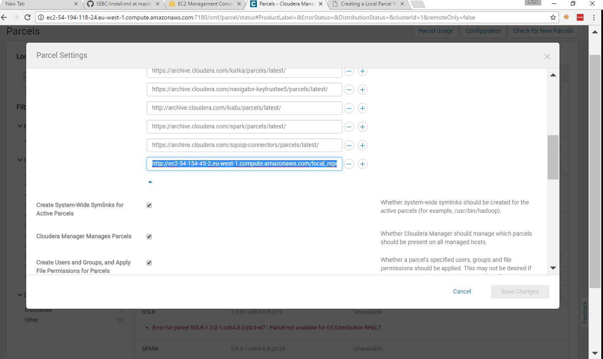
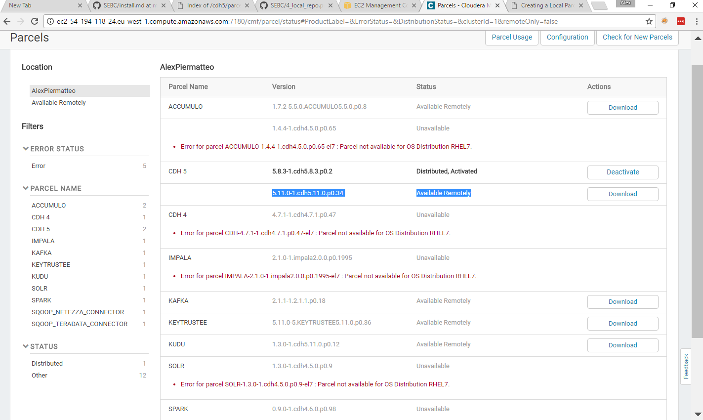

## Create a Local Repository
The local repository is installed on the last node of the cluster (sebc5).
To install it, simply start the httpd daemon and enable auto startup:
```
[ec2-user@ip-10-0-0-120 ~]$ sudo service httpd start
[ec2-user@ip-10-0-0-120 ~]$ sudo chkconfig httpd on
```
Create the local repo folder using the following command:
```
[ec2-user@ip-10-0-0-120 ~]$ sudo mkdir /var/www/html/local_repo
```

And add the local repository to cloudera manager parcel configuration:


To add new parcels to the repo, simply stop the httpd daemon, copy the `.parcel` file in the folder `/var/www/html/local_repo` and create a `manifest.json` file containing all the information regarding the locally available parcels. Once the daemon is restarted, all the parcels will be available from cloudera manager.

For example, the parcels for CDH 5.11.0 have been added to the repository:
```
[ec2-user@ip-10-0-0-120 ~]$ wget http://archive.cloudera.com/cdh5/parcels/latest/CDH-5.1 1.0-1.cdh5.11.0.p0.34-el7.parcel

[ec2-user@ip-10-0-0-120 ~]$ wget http://archive.cloudera.com/cdh5/parcels/latest/manifest.json

[ec2-user@ip-10-0-0-120 ~]$ ls /var/www/html/local_repo/
CDH-5.11.0-1.cdh5.11.0.p0.34-el7.parcel  manifest.json
```
