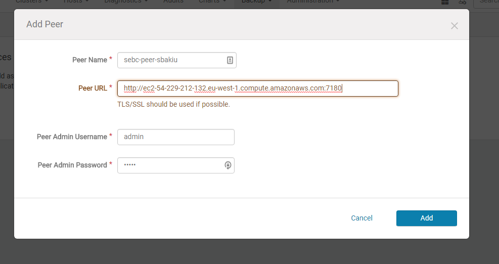
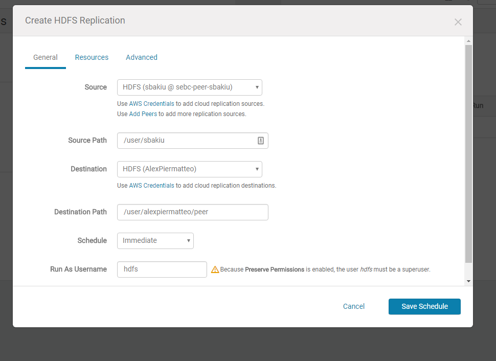
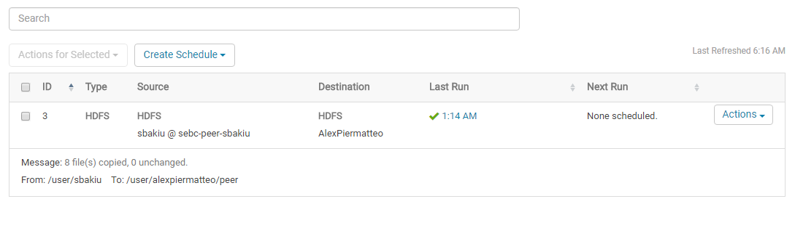

## Decision of the partner and creation folders

My partner for this lab is Sadik Bakiu.
I will create now two new directories on the hdfs, one for the target (/user/alexpiermatteo) and one for source (/user/sbakiu):
```
[ec2-user@ip-10-0-0-22 ~]$ sudo -u hdfs hadoop fs -mkdir /user/alexpiermatteo
[ec2-user@ip-10-0-0-22 ~]$ sudo -u hdfs hadoop fs -mkdir /user/sbakiu
```

## Generation 500MB file
This is the command that has to be executed in order to use `teragen` to create a 500MB file on the folder `/user/sbakiu/teragen`:
```
[ec2-user@ip-10-0-0-22 ~]$ sudo -u hdfs hadoop jar /opt/cloudera/parcels/CDH-5.8.3-1.cdh 5.8.3.p0.2/jars/hadoop-examples.jar teragen 5242880 /user/sbakiu/teragen

17/06/06 05:06:31 INFO Configuration.deprecation: session.id is deprecated. Instead, use dfs.metrics.session-id
17/06/06 05:06:31 INFO jvm.JvmMetrics: Initializing JVM Metrics with processName=JobTracker, sessionId=
17/06/06 05:06:32 INFO terasort.TeraSort: Generating 5242880 using 1
17/06/06 05:06:32 INFO mapreduce.JobSubmitter: number of splits:1
17/06/06 05:06:32 INFO mapreduce.JobSubmitter: Submitting tokens for job: job_local1782293026_0001
17/06/06 05:06:32 INFO mapreduce.Job: The url to track the job: http://localhost:8080/
17/06/06 05:06:32 INFO mapreduce.Job: Running job: job_local1782293026_0001
17/06/06 05:06:32 INFO mapred.LocalJobRunner: OutputCommitter set in config null
17/06/06 05:06:32 INFO output.FileOutputCommitter: File Output Committer Algorithm version is 1
17/06/06 05:06:32 INFO mapred.LocalJobRunner: OutputCommitter is org.apache.hadoop.mapreduce.lib.output.FileOutputCommitter
17/06/06 05:06:32 INFO mapred.LocalJobRunner: Waiting for map tasks
17/06/06 05:06:32 INFO mapred.LocalJobRunner: Starting task: attempt_local1782293026_0001_m_000000_0
17/06/06 05:06:32 INFO output.FileOutputCommitter: File Output Committer Algorithm version is 1
17/06/06 05:06:32 INFO mapred.Task:  Using ResourceCalculatorProcessTree : [ ]
17/06/06 05:06:32 INFO mapred.MapTask: Processing split: org.apache.hadoop.examples.terasort.TeraGen$RangeInputFormat$RangeInputSplit@1b616dfe
17/06/06 05:06:33 INFO mapreduce.Job: Job job_local1782293026_0001 running in uber mode : false
17/06/06 05:06:33 INFO mapreduce.Job:  map 0% reduce 0%
17/06/06 05:06:38 INFO mapred.LocalJobRunner: map > map
17/06/06 05:06:38 INFO mapred.LocalJobRunner: map > map
17/06/06 05:06:38 INFO mapred.Task: Task:attempt_local1782293026_0001_m_000000_0 is done. And is in the process of committing
17/06/06 05:06:38 INFO mapred.LocalJobRunner: map > map
17/06/06 05:06:38 INFO mapred.Task: Task attempt_local1782293026_0001_m_000000_0 is allowed to commit now
17/06/06 05:06:38 INFO output.FileOutputCommitter: Saved output of task 'attempt_local1782293026_0001_m_000000_0' to hdfs://ip-10-0-0-22.eu-west-1.compute.internal:8020/user/sbakiu/teragen/_temporary/0/task_local1782293026_0001_m_000000
17/06/06 05:06:38 INFO mapred.LocalJobRunner: map
17/06/06 05:06:38 INFO mapred.Task: Task 'attempt_local1782293026_0001_m_000000_0' done. 17/06/06 05:06:38 INFO mapred.LocalJobRunner: Finishing task: attempt_local1782293026_0001_m_000000_0
17/06/06 05:06:38 INFO mapred.LocalJobRunner: map task executor complete.
17/06/06 05:06:39 INFO mapreduce.Job:  map 100% reduce 0%
17/06/06 05:06:39 INFO mapreduce.Job: Job job_local1782293026_0001 completed successfully

17/06/06 05:06:39 INFO mapreduce.Job: Counters: 21
        File System Counters
                FILE: Number of bytes read=276333
                FILE: Number of bytes written=560947
                FILE: Number of read operations=0
                FILE: Number of large read operations=0
                FILE: Number of write operations=0
                HDFS: Number of bytes read=0
                HDFS: Number of bytes written=524288000
                HDFS: Number of read operations=4
                HDFS: Number of large read operations=0
                HDFS: Number of write operations=3
        Map-Reduce Framework
                Map input records=5242880
                Map output records=5242880
                Input split bytes=82
                Spilled Records=0
                Failed Shuffles=0
                Merged Map outputs=0
                GC time elapsed (ms)=80
                Total committed heap usage (bytes)=202899456
        org.apache.hadoop.examples.terasort.TeraGen$Counters
                CHECKSUM=11257830824958050
        File Input Format Counters
                Bytes Read=0
        File Output Format Counters
                Bytes Written=524288000
```

Please find below the prove that the `teragen` worked on the target folder on my cluster:
```
[ec2-user@ip-10-0-0-22 ~]$ hadoop fs -ls /user/sbakiu/teragen
Found 2 items
-rw-r--r--   3 hdfs supergroup          0 2017-06-06 05:06 /user/sbakiu/teragen/_SUCCESS 
-rw-r--r--   3 hdfs supergroup  524288000 2017-06-06 05:06 /user/sbakiu/teragen/part-m-00000
```
This files will be copied to `sbakiu` cluster by him using the `distcp` command.


In the meantime I copied the teragen made by Sadik Bakiu from his cluster in my target directory (/user/alexpiermatteo):
```
[ec2-user@ip-10-0-0-22 ~]$ sudo -u hdfs hadoop distcp hdfs://ip-10-0-0-100.eu-west-1.com pute.internal:8020/user/sbakiu/teragen hdfs://ip-10-0-0-22.eu-west-1.compute.internal:80 20/user/alexpiermatteo/teragen_from_sbakiu
17/06/06 05:27:35 INFO tools.DistCp: Input Options: DistCpOptions{atomicCommit=false, syncFolder=false, deleteMissing=false, ignoreFailures=false, overwrite=false, skipCRC=false, blocking=true, numListstatusThreads=0, maxMaps=20, mapBandwidth=100, sslConfigurationFile='null', copyStrategy='uniformsize', preserveStatus=[], preserveRawXattrs=false, atomicWorkPath=null, logPath=null, sourceFileListing=null, sourcePaths=[hdfs://ip-10-0-0-100.eu-west-1.compute.internal:8020/user/sbakiu/teragen], targetPath=hdfs://ip-10-0-0-22.eu-west-1.compute.internal:8020/user/alexpiermatteo/teragen_from_sbakiu, targetPathExists=false, filtersFile='null'}
17/06/06 05:27:35 INFO Configuration.deprecation: session.id is deprecated. Instead, use dfs.metrics.session-id
17/06/06 05:27:35 INFO jvm.JvmMetrics: Initializing JVM Metrics with processName=JobTracker, sessionId=
17/06/06 05:27:35 INFO tools.SimpleCopyListing: Paths (files+dirs) cnt = 4; dirCnt = 1
17/06/06 05:27:35 INFO tools.SimpleCopyListing: Build file listing completed.
17/06/06 05:27:35 INFO Configuration.deprecation: io.sort.mb is deprecated. Instead, use mapreduce.task.io.sort.mb
17/06/06 05:27:35 INFO Configuration.deprecation: io.sort.factor is deprecated. Instead, use mapreduce.task.io.sort.factor
17/06/06 05:27:35 INFO tools.DistCp: Number of paths in the copy list: 4
17/06/06 05:27:35 INFO tools.DistCp: Number of paths in the copy list: 4
17/06/06 05:27:35 INFO jvm.JvmMetrics: Cannot initialize JVM Metrics with processName=JobTracker, sessionId= - already initialized
17/06/06 05:27:35 INFO mapreduce.JobSubmitter: number of splits:1
17/06/06 05:27:35 INFO mapreduce.JobSubmitter: Submitting tokens for job: job_local798297085_0001
17/06/06 05:27:35 INFO mapreduce.Job: The url to track the job: http://localhost:8080/
17/06/06 05:27:35 INFO tools.DistCp: DistCp job-id: job_local798297085_0001
17/06/06 05:27:35 INFO mapreduce.Job: Running job: job_local798297085_0001
17/06/06 05:27:35 INFO mapred.LocalJobRunner: OutputCommitter set in config null
17/06/06 05:27:35 INFO output.FileOutputCommitter: File Output Committer Algorithm version is 1
17/06/06 05:27:35 INFO mapred.LocalJobRunner: OutputCommitter is org.apache.hadoop.tools.mapred.CopyCommitter
17/06/06 05:27:36 INFO mapred.LocalJobRunner: Waiting for map tasks
17/06/06 05:27:36 INFO mapred.LocalJobRunner: Starting task: attempt_local798297085_0001_m_000000_0
17/06/06 05:27:36 INFO output.FileOutputCommitter: File Output Committer Algorithm version is 1
17/06/06 05:27:36 INFO mapred.Task:  Using ResourceCalculatorProcessTree : [ ]
17/06/06 05:27:36 INFO mapred.MapTask: Processing split: file:/tmp/hadoop-hdfs/mapred/staging/hdfs997553541/.staging/_distcp-1928696550/fileList.seq:0+800
17/06/06 05:27:36 INFO output.FileOutputCommitter: File Output Committer Algorithm version is 1
17/06/06 05:27:36 INFO mapred.CopyMapper: Copying hdfs://ip-10-0-0-100.eu-west-1.compute.internal:8020/user/sbakiu/teragen to hdfs://ip-10-0-0-22.eu-west-1.compute.internal:8020/user/alexpiermatteo/teragen_from_sbakiu
17/06/06 05:27:36 INFO mapred.CopyMapper: Copying hdfs://ip-10-0-0-100.eu-west-1.compute.internal:8020/user/sbakiu/teragen/_SUCCESS to hdfs://ip-10-0-0-22.eu-west-1.compute.internal:8020/user/alexpiermatteo/teragen_from_sbakiu/_SUCCESS
17/06/06 05:27:36 INFO mapred.RetriableFileCopyCommand: Creating temp file: hdfs://ip-10-0-0-22.eu-west-1.compute.internal:8020/user/alexpiermatteo/teragen_from_sbakiu/.distcp.tmp.attempt_local798297085_0001_m_000000_0
17/06/06 05:27:36 INFO mapred.CopyMapper: Copying hdfs://ip-10-0-0-100.eu-west-1.compute.internal:8020/user/sbakiu/teragen/part-m-00000 to hdfs://ip-10-0-0-22.eu-west-1.compute.internal:8020/user/alexpiermatteo/teragen_from_sbakiu/part-m-00000
17/06/06 05:27:36 INFO mapred.RetriableFileCopyCommand: Creating temp file: hdfs://ip-10-0-0-22.eu-west-1.compute.internal:8020/user/alexpiermatteo/teragen_from_sbakiu/.distcp.tmp.attempt_local798297085_0001_m_000000_0
17/06/06 05:27:36 INFO mapreduce.Job: Job job_local798297085_0001 running in uber mode : false
17/06/06 05:27:36 INFO mapreduce.Job:  map 0% reduce 0%
17/06/06 05:27:39 INFO mapred.CopyMapper: Copying hdfs://ip-10-0-0-100.eu-west-1.compute.internal:8020/user/sbakiu/teragen/part-m-00001 to hdfs://ip-10-0-0-22.eu-west-1.compute.internal:8020/user/alexpiermatteo/teragen_from_sbakiu/part-m-00001
17/06/06 05:27:39 INFO mapred.RetriableFileCopyCommand: Creating temp file: hdfs://ip-10-0-0-22.eu-west-1.compute.internal:8020/user/alexpiermatteo/teragen_from_sbakiu/.distcp.tmp.attempt_local798297085_0001_m_000000_0
17/06/06 05:27:42 INFO mapred.LocalJobRunner: 72.5% Copying hdfs://ip-10-0-0-100.eu-west-1.compute.internal:8020/user/sbakiu/teragen/part-m-00001 to hdfs://ip-10-0-0-22.eu-west-1.compute.internal:8020/user/alexpiermatteo/teragen_from_sbakiu/part-m-00001 [181.2M/250.0M] > map
17/06/06 05:27:42 INFO mapreduce.Job:  map 100% reduce 0%
17/06/06 05:27:43 INFO mapred.LocalJobRunner: 72.5% Copying hdfs://ip-10-0-0-100.eu-west-1.compute.internal:8020/user/sbakiu/teragen/part-m-00001 to hdfs://ip-10-0-0-22.eu-west-1.compute.internal:8020/user/alexpiermatteo/teragen_from_sbakiu/part-m-00001 [181.2M/250.0M] > map
17/06/06 05:27:43 INFO mapred.Task: Task:attempt_local798297085_0001_m_000000_0 is done. And is in the process of committing
17/06/06 05:27:43 INFO mapred.LocalJobRunner: 72.5% Copying hdfs://ip-10-0-0-100.eu-west-1.compute.internal:8020/user/sbakiu/teragen/part-m-00001 to hdfs://ip-10-0-0-22.eu-west-1.compute.internal:8020/user/alexpiermatteo/teragen_from_sbakiu/part-m-00001 [181.2M/250.0M] > map
17/06/06 05:27:43 INFO mapred.Task: Task attempt_local798297085_0001_m_000000_0 is allowed to commit now
17/06/06 05:27:43 INFO output.FileOutputCommitter: Saved output of task 'attempt_local798297085_0001_m_000000_0' to file:/tmp/hadoop-hdfs/mapred/staging/hdfs997553541/.staging/_distcp-1928696550/_logs/_temporary/0/task_local798297085_0001_m_000000
17/06/06 05:27:43 INFO mapred.LocalJobRunner: 100.0% Copying hdfs://ip-10-0-0-100.eu-west-1.compute.internal:8020/user/sbakiu/teragen/part-m-00001 to hdfs://ip-10-0-0-22.eu-west-1.compute.internal:8020/user/alexpiermatteo/teragen_from_sbakiu/part-m-00001 [250.0M/250.0M]
17/06/06 05:27:43 INFO mapred.Task: Task 'attempt_local798297085_0001_m_000000_0' done.
17/06/06 05:27:43 INFO mapred.LocalJobRunner: Finishing task: attempt_local798297085_0001_m_000000_0
17/06/06 05:27:43 INFO mapred.LocalJobRunner: map task executor complete.
17/06/06 05:27:43 INFO mapred.CopyCommitter: Cleaning up temporary work folder: file:/tmp/hadoop-hdfs/mapred/staging/hdfs997553541/.staging/_distcp-1928696550
17/06/06 05:27:43 INFO mapreduce.Job: Job job_local798297085_0001 completed successfully 17/06/06 05:27:44 INFO mapreduce.Job: Counters: 23
        File System Counters
                FILE: Number of bytes read=1958301
                FILE: Number of bytes written=2259734
                FILE: Number of read operations=0
                FILE: Number of large read operations=0
                FILE: Number of write operations=0
                HDFS: Number of bytes read=524288000
                HDFS: Number of bytes written=524288000
                HDFS: Number of read operations=40
                HDFS: Number of large read operations=0
                HDFS: Number of write operations=7
        Map-Reduce Framework
                Map input records=4
                Map output records=0
                Input split bytes=156
                Spilled Records=0
                Failed Shuffles=0
                Merged Map outputs=0
                GC time elapsed (ms)=72
                Total committed heap usage (bytes)=229638144
        File Input Format Counters
                Bytes Read=836
        File Output Format Counters
                Bytes Written=8
        org.apache.hadoop.tools.mapred.CopyMapper$Counter
                BYTESCOPIED=524288000
                BYTESEXPECTED=524288000
                COPY=4
```

Running `fsck` on target (/user/alexpiermatteo) and on the source (/user/sbakiu), outputs the following information:
```
[ec2-user@ip-10-0-0-22 ~]$ sudo -u hdfs hadoop fsck /user/alexpiermatteo/teragen_from_sb akiu/part-m-00000 -files -blocks
DEPRECATED: Use of this script to execute hdfs command is deprecated.
Instead use the hdfs command for it.

Connecting to namenode via http://ip-10-0-0-22.eu-west-1.compute.internal:50070
FSCK started by hdfs (auth:SIMPLE) from /10.0.0.22 for path /user/alexpiermatteo/teragen_from_sbakiu/part-m-00000 at Tue Jun 06 05:36:29 EDT 2017
/user/alexpiermatteo/teragen_from_sbakiu/part-m-00000 262144000 bytes, 1 block(s):  OK
0. BP-889759657-10.0.0.22-1496678098377:blk_1073743573_2749 len=262144000 Live_repl=3

Status: HEALTHY
 Total size:    262144000 B
 Total dirs:    0
 Total files:   1
 Total symlinks:                0
 Total blocks (validated):      1 (avg. block size 262144000 B)
 Minimally replicated blocks:   1 (100.0 %)
 Over-replicated blocks:        0 (0.0 %)
 Under-replicated blocks:       0 (0.0 %)
 Mis-replicated blocks:         0 (0.0 %)
 Default replication factor:    3
 Average block replication:     3.0
 Corrupt blocks:                0
 Missing replicas:              0 (0.0 %)
 Number of data-nodes:          4
 Number of racks:               1
FSCK ended at Tue Jun 06 05:36:29 EDT 2017 in 1 milliseconds


The filesystem under path '/user/alexpiermatteo/teragen_from_sbakiu/part-m-00000' is HEALTHY

[ec2-user@ip-10-0-0-22 ~]$ sudo -u hdfs hadoop fsck /user/alexpiermatteo/teragen_from_sbakiu/part-m-00001 -files -blocks
DEPRECATED: Use of this script to execute hdfs command is deprecated.
Instead use the hdfs command for it.

Connecting to namenode via http://ip-10-0-0-22.eu-west-1.compute.internal:50070
FSCK started by hdfs (auth:SIMPLE) from /10.0.0.22 for path /user/alexpiermatteo/teragen_from_sbakiu/part-m-00001 at Tue Jun 06 05:37:24 EDT 2017
/user/alexpiermatteo/teragen_from_sbakiu/part-m-00001 262144000 bytes, 1 block(s):  OK
0. BP-889759657-10.0.0.22-1496678098377:blk_1073743574_2750 len=262144000 Live_repl=3

Status: HEALTHY
 Total size:    262144000 B
 Total dirs:    0
 Total files:   1
 Total symlinks:                0
 Total blocks (validated):      1 (avg. block size 262144000 B)
 Minimally replicated blocks:   1 (100.0 %)
 Over-replicated blocks:        0 (0.0 %)
 Under-replicated blocks:       0 (0.0 %)
 Mis-replicated blocks:         0 (0.0 %)
 Default replication factor:    3
 Average block replication:     3.0
 Corrupt blocks:                0
 Missing replicas:              0 (0.0 %)
 Number of data-nodes:          4
 Number of racks:               1
FSCK ended at Tue Jun 06 05:37:24 EDT 2017 in 1 milliseconds


The filesystem under path '/user/alexpiermatteo/teragen_from_sbakiu/part-m-00001' is HEALTHY

(Sadik Bakiu generated two parts file)


[ec2-user@ip-10-0-0-22 ~]$ sudo -u hdfs hadoop fsck /user/sbakiu/teragen/part-m-00000 -f iles -blocks
DEPRECATED: Use of this script to execute hdfs command is deprecated.
Instead use the hdfs command for it.

Connecting to namenode via http://ip-10-0-0-22.eu-west-1.compute.internal:50070
FSCK started by hdfs (auth:SIMPLE) from /10.0.0.22 for path /user/sbakiu/teragen/part-m-00000 at Tue Jun 06 05:38:39 EDT 2017
/user/sbakiu/teragen/part-m-00000 524288000 bytes, 2 block(s):  OK
0. BP-889759657-10.0.0.22-1496678098377:blk_1073743540_2716 len=268435456 Live_repl=3
1. BP-889759657-10.0.0.22-1496678098377:blk_1073743542_2718 len=255852544 Live_repl=3

Status: HEALTHY
 Total size:    524288000 B
 Total dirs:    0
 Total files:   1
 Total symlinks:                0
 Total blocks (validated):      2 (avg. block size 262144000 B)
 Minimally replicated blocks:   2 (100.0 %)
 Over-replicated blocks:        0 (0.0 %)
 Under-replicated blocks:       0 (0.0 %)
 Mis-replicated blocks:         0 (0.0 %)
 Default replication factor:    3
 Average block replication:     3.0
 Corrupt blocks:                0
 Missing replicas:              0 (0.0 %)
 Number of data-nodes:          4
 Number of racks:               1
FSCK ended at Tue Jun 06 05:38:39 EDT 2017 in 1 milliseconds


The filesystem under path '/user/sbakiu/teragen/part-m-00000' is HEALTHY
```


Enable replication:

- Click on cloudera manager on Backup->Peers and add a new peer:


- After creating the peer, click on Backup->Replication Schedules and create a new replication schedule:


- Then start the schedule:
