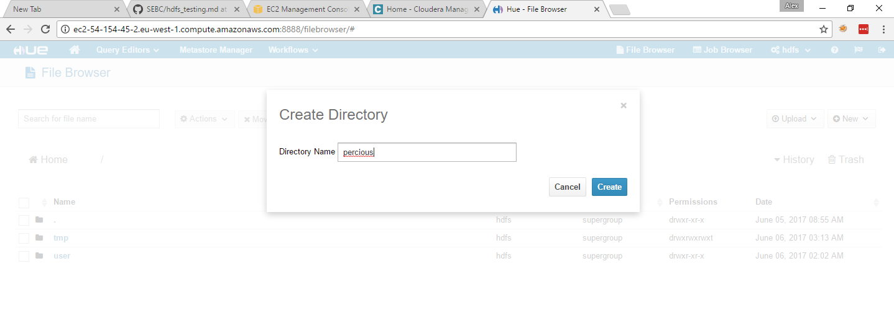
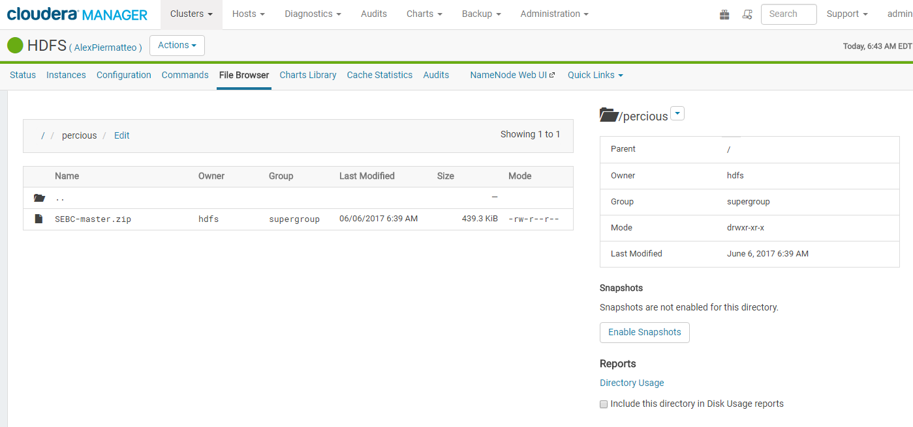
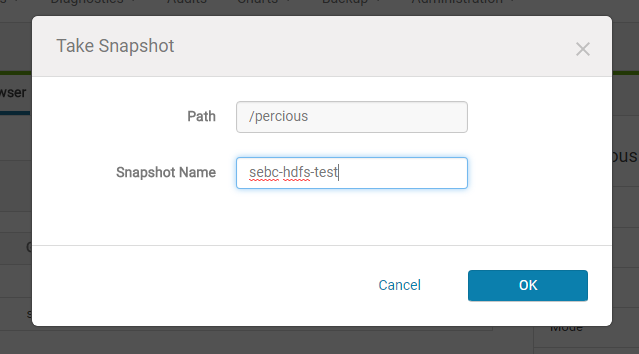
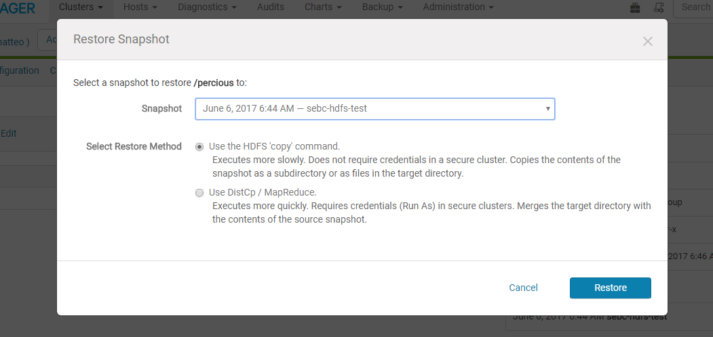

## HDFS Snapshots

I created the `percious` directory and I uploded the zip file using Hue:


To make the folder snapshottable lets use the navigator (http://ec2-54-194-118-24.eu-west-1.compute.amazonaws.com:7180/cmf/services/19/browse#path=%2F) and navigate to the folder /percious and click on "Enable Snapshots".


Once the folder is snapshottable, we can take a snapshot:



Is not possible to delete the folder since it's marked as snapshottable but we can delete the zip file.
After delete the file with HUE check with the command line that the file have been actually deleted:
```
[ec2-user@ip-10-0-0-22 ~]$ hadoop fs -ls /percious
(no output)
```

To restore the folder from the snapshot just click on 'Restore Directory From Snapshot' in the navigator:


And as we can see, the zip file is restored:
```
[ec2-user@ip-10-0-0-22 ~]$ hadoop fs -ls /percious
Found 1 items
-rw-r--r--   3 hdfs supergroup     449822 2017-06-06 06:49 /percious/SEBC-master.zip
```